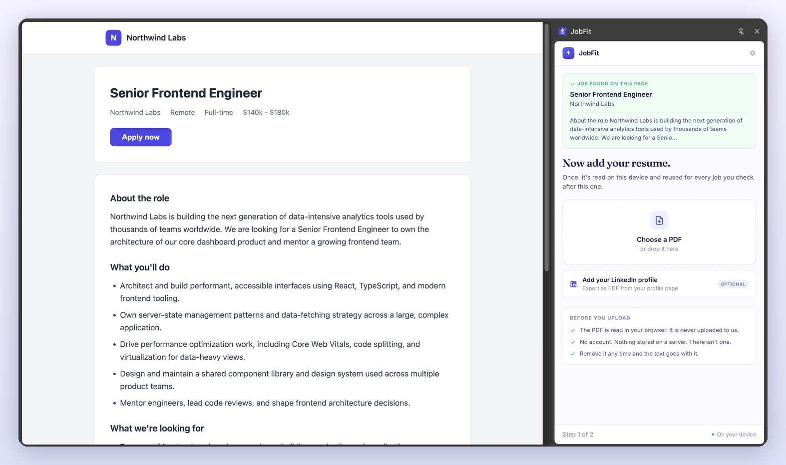
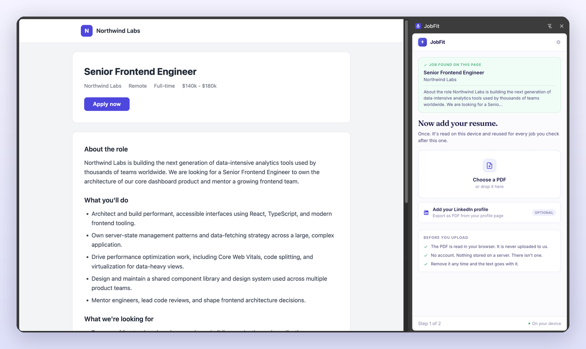
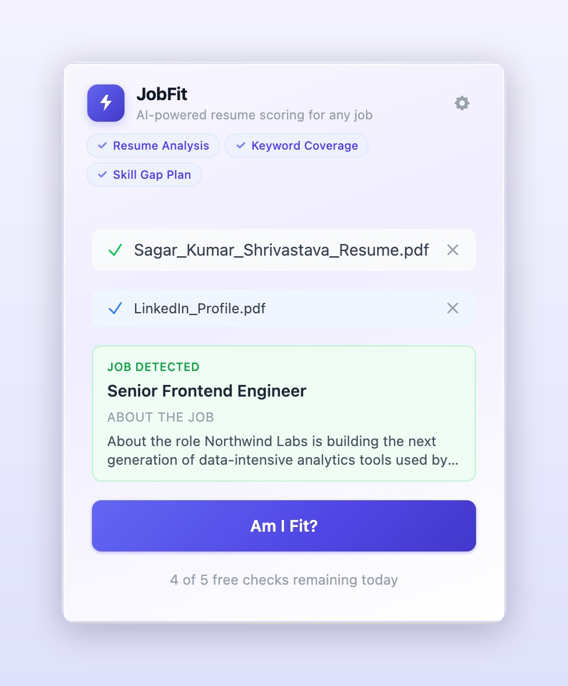
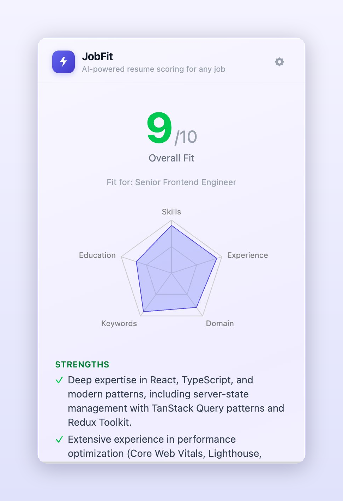
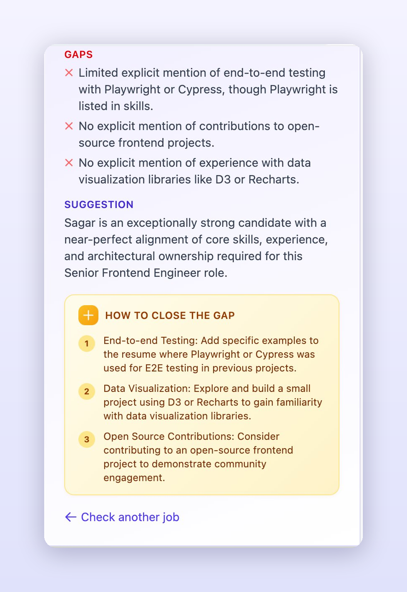
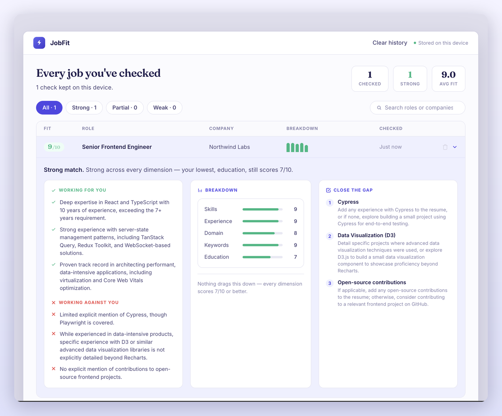

# JobFit — Am I Fit?

**Know in seconds whether a job is worth applying to.**

JobFit is a Chrome extension that compares your resume against any job posting and returns an instant fit score with a five-dimension breakdown and a concrete action plan — in one click, right from your browser toolbar.

[**Add to Chrome →**](https://chromewebstore.google.com/detail/JobFit/lghnjblnkagdmfhemmdocnicficmniak) · [Landing page](https://sinhasagar01.github.io/job-fit-extension/)


---

## Key features

- **One-click fit score** — click the JobFit icon on any job page, press "Am I Fit?", and get a score in seconds
- **Five-dimension breakdown** — Skills Match, Experience Level, Domain/Industry, Keyword Coverage, and Education/Certs, each scored 1–10
- **Explainable** — every score comes with what's working for you, what's working against you, and why
- **Actionable gap-closing plan** — specific steps drawn from the actual posting and your actual resume
- **Every check kept** — past checks are saved on your device; re-checking the same job is instant, free, and returns the same answer
- **Works anywhere** — native extraction on LinkedIn, Greenhouse, Lever, and Ashby, with structured-data and title-parse fallbacks; paste-fallback for every other job site
- **Private by design** — your resume is parsed and stored on your device; free checks go through JobFit's server (which keeps none of your content and never logs it), or add your own key and scoring goes straight from your browser to the provider — never our server
- **Bring your own key** — connect Google Gemini or Groq with your own API key; no subscription, no middleman

---

## How it works

### Step 1 — Upload your resume


Open the side panel and upload your PDF resume. Text is extracted in-browser using `pdf.js` and saved locally. Optionally add a LinkedIn PDF export for richer context.

### Step 2 — Open any job posting



Land on a listing and click the JobFit icon. The side panel opens beside the page and reads the role, company, and description straight off it.

### Step 3 — Ask "Am I Fit?"



One click scores your resume against the open role. The request goes directly from your browser to your chosen AI provider.

### Step 4 — See your fit score



An overall 1–10 score with the five-dimension breakdown, your strongest and weakest axes, and the reasoning behind each.

### Step 5 — Close the gap



A prioritised action plan grounded in the specific requirements of that posting.

### Every check, kept



Past checks live in a full-page tracker — filter by fit band, search by role or company, expand any row for the full breakdown. Stored on your device; clear it any time.

---

## Tech stack

| Layer               | Library                                                 |
| ------------------- | ------------------------------------------------------- |
| Extension framework | [WXT](https://wxt.dev) (Chrome MV3)                     |
| UI                  | React 19 + TypeScript                                   |
| Styling             | Tailwind CSS                                            |
| PDF parsing         | pdfjs-dist                                              |
| Fonts               | Fraunces + Inter, self-hosted via Fontsource            |
| Testing             | Vitest + React Testing Library                          |
| CI                  | GitHub Actions (type-check, tests, build on every push) |

---

## Architecture in one paragraph

The side panel is the only UI surface. Clicking the toolbar icon fires `action.onClicked`, which grants `activeTab` for that tab and opens the panel; a background→panel message then triggers `extractJd` via `chrome.scripting.executeScript` — a one-time, read-only injection, with no persistent content script. Scoring sits behind a `ScoringClient` interface with Gemini and Groq implementations plus a mock, and every response passes through `validateFitResult`, which clamps each dimension and computes the overall as a weighted mean rather than trusting the model's own number. Results are cached in `chrome.storage.local` keyed on a hash of profile + JD, so an identical check costs neither an API call nor a free check.

---

## Privacy

Two ways to score, handled differently:

- Your resume text is stored in `chrome.storage.local` — a private, per-extension store on your machine
- Job description extraction happens entirely in your browser, and only when you click the icon — never in the background or on page load
- Saved checks (scores, breakdowns, plans, job titles) are stored on your device and never transmitted
- **Free checks** go to JobFit's scoring server, which passes your resume and the job text to our AI provider (OpenAI) and returns the result — we keep **none of your content** (processed and dropped, never stored or logged); only anonymous per-install and per-IP counters (the IP hashed) run the daily limit
- **With your own key**, the scoring call goes straight from your browser to your chosen provider (Gemini or Groq) and never touches our server
- Either way, JobFit never stores your resume anywhere but your device, and we never sell your data or train on it

Full details: [Privacy policy](https://gist.github.com/sinhasagar01/d1a69bd31c727e7a3db9c4461db6d3cb)

---

## Local development

```bash
npm install
npm run dev        # dev build + WXT's managed browser
```

Or load the production build into your own Chrome — better if you want your existing profile and API key:

```bash
npm run build
```

Then open `chrome://extensions`, enable **Developer Mode**, click **Load unpacked**, and select `.output/chrome-mv3/`. After any change, rebuild and hit **⟳ reload** on the extension card.

```bash
npm run compile    # type-check only (no emit)
npm run test       # tests in watch mode
npm run test:run   # single pass, CI-safe
```

### Scoring evaluation

The `eval/` harness measures scoring stability — fixed (resume, JD) pairs run N times against a provider, reporting per-dimension mean and standard deviation. A baseline is only valid if it prints `✓ COMPLETE` (every pair reached `n == runs` with zero failures); it exits non-zero otherwise.

```bash
GEMINI_API_KEY=your_key npm run eval -- --provider gemini --runs 5
```

See [eval/README.md](eval/README.md) for the full options.

---
