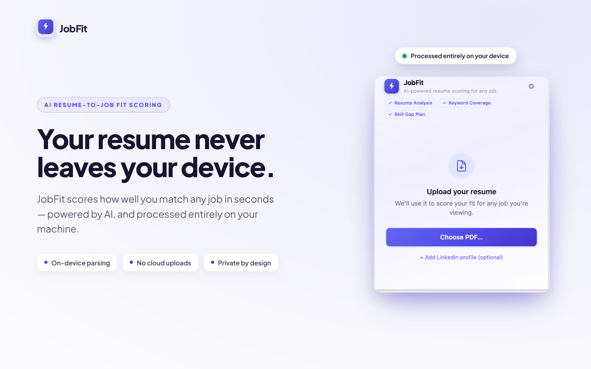
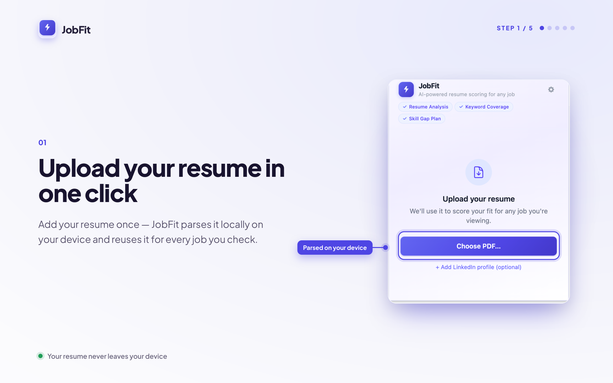
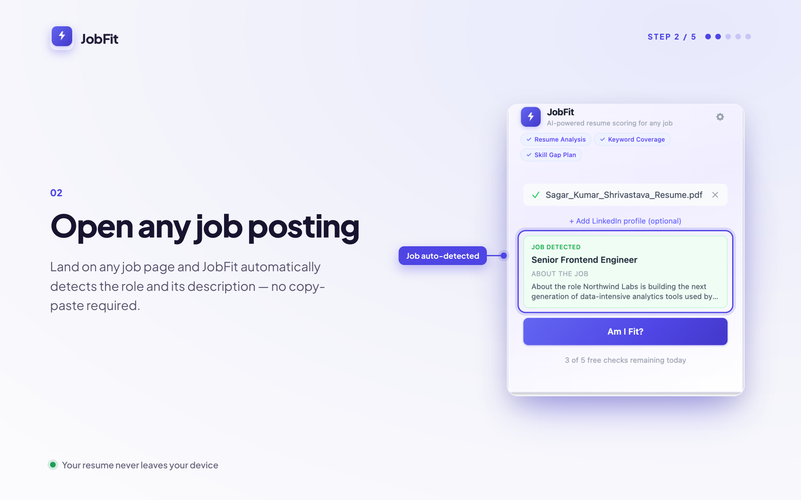
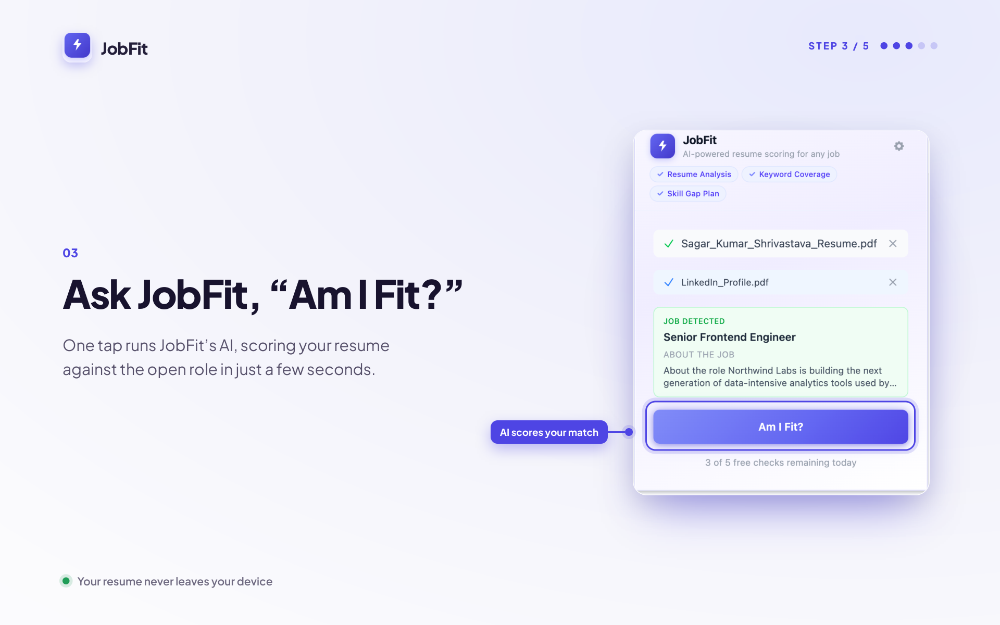
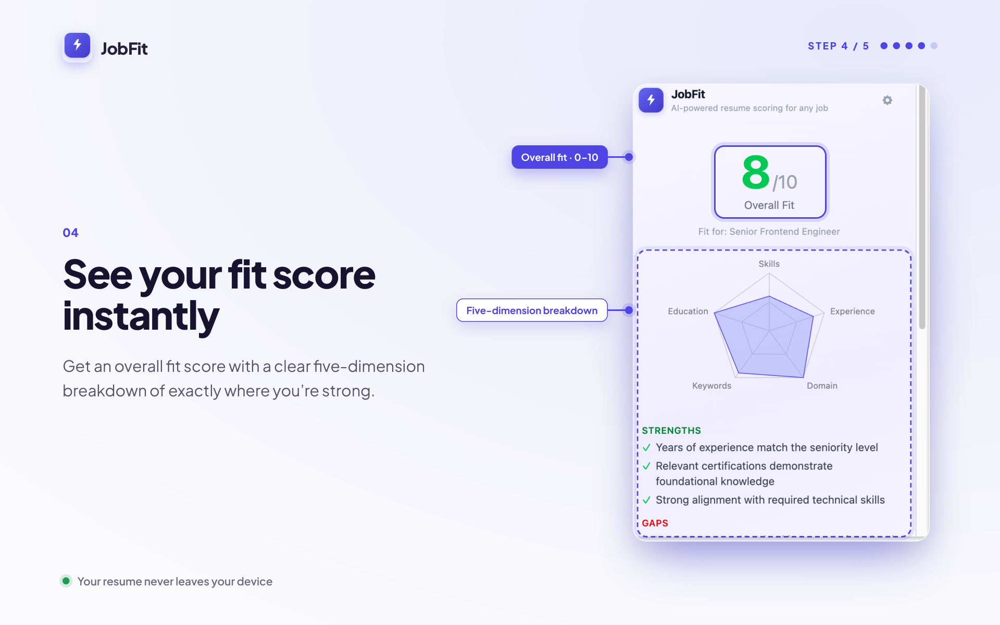

# JobFit — Am I Fit?

**Know in seconds whether a job is worth applying to.**

JobFit is a Chrome extension that compares your resume against any job posting and returns an instant fit score with a 5-dimension breakdown and a concrete action plan — all without your resume ever leaving your device.

---

## Key features

- **One-click fit score** — press "Am I Fit?" on any job page and get a score in seconds
- **5-dimension breakdown** — radar chart across Skills Match, Experience Level, Domain Fit, Soft Skills, and Role Scope
- **Actionable gap-closing plan** — specific steps to address each weak dimension before you apply
- **Works anywhere** — native extraction on LinkedIn, Greenhouse, Lever, and Ashby; paste-fallback for every other job site
- **Local-first privacy** — your resume is extracted on-device and stored only in `chrome.storage.local`; it is never sent to any server the developer controls
- **Bring your own key** — connect Google Gemini or Groq with your own API key; no subscription, no middleman

---

## How it works

### Step 1 — Upload your resume



Open the popup and upload your PDF resume. Text is extracted in-browser using `pdf.js` and saved locally.

### Step 2 — (Optional) Add your LinkedIn profile



Upload a LinkedIn PDF export for richer context. Stored locally alongside your resume.

### Step 3 — Enter your API key



Go to Settings and paste a Gemini or Groq API key. Stored in `chrome.storage.local` on your device only.

### Step 4 — Navigate to a job posting and score it



Open any job listing and click "Am I Fit?" in the toolbar. JobFit extracts the job description and calls your AI provider directly.

### Step 5 — Review your results and action plan



See your overall fit score, per-dimension radar chart, top strengths, key gaps, and a tailored action plan.

---

## Tech stack

| Layer | Library |
|-------|---------|
| Extension framework | [WXT](https://wxt.dev) (Chrome MV3) |
| UI | React 19 + TypeScript |
| Styling | Tailwind CSS |
| Charts | Recharts |
| PDF parsing | pdfjs-dist |

---

## Privacy

JobFit is local-first by design:

- Your resume text is stored in `chrome.storage.local` — a private, per-extension store on your machine
- Job description extraction happens entirely in your browser
- The **only** outbound request is the scoring call, which goes directly from your browser to your chosen AI provider (Gemini or Groq) using your own API key
- The extension developer receives no data, no telemetry, and no API traffic

Full details: [PRIVACY.md](PRIVACY.md)

---

## Local development

```bash
npm install
npm run dev        # Chrome (default)
npm run dev:firefox
```

Then open `chrome://extensions`, enable **Developer Mode**, click **Load unpacked**, and select `.output/chrome-mv3-dev/`.

```bash
npm run build      # Production build for Chrome
npm run compile    # Type-check only (no emit)
```

---

## Architecture

For a guided tour of the codebase — extension contexts, WXT conventions, the scoring pipeline, and storage design — see [ARCHITECTURE.md](ARCHITECTURE.md).
